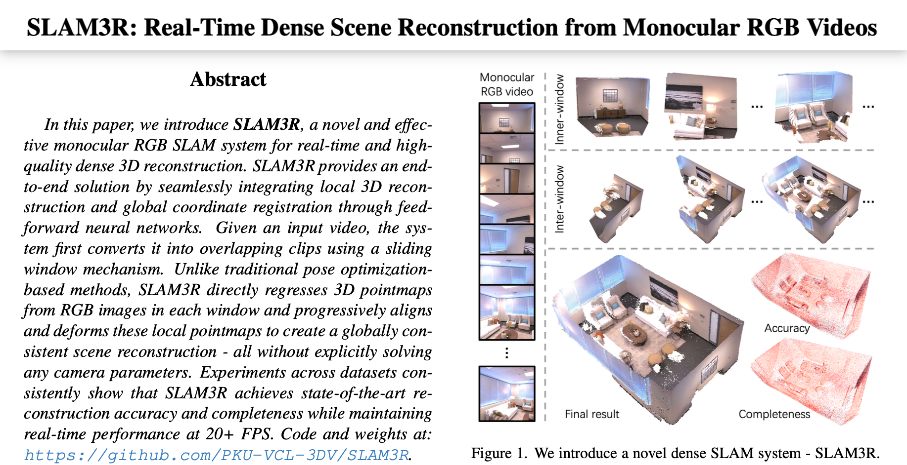
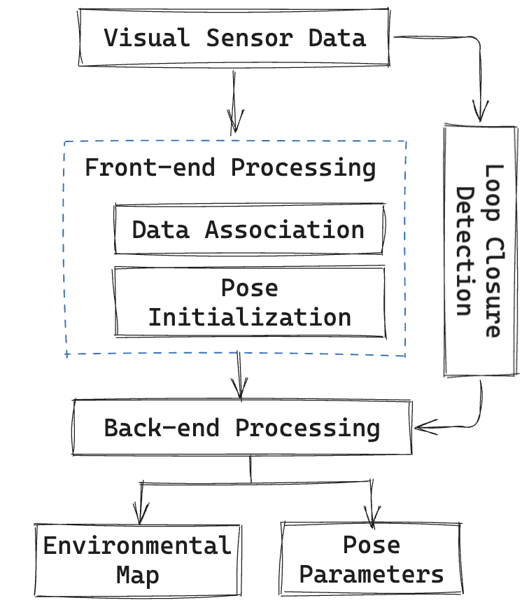
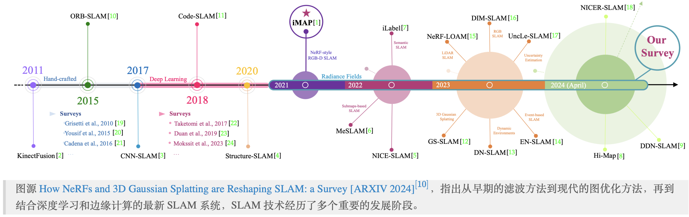
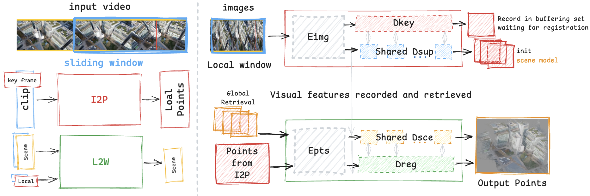
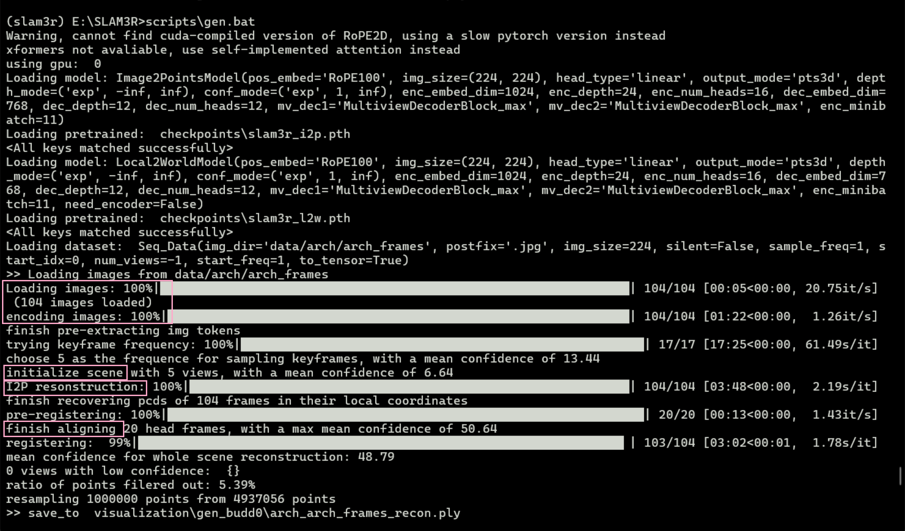
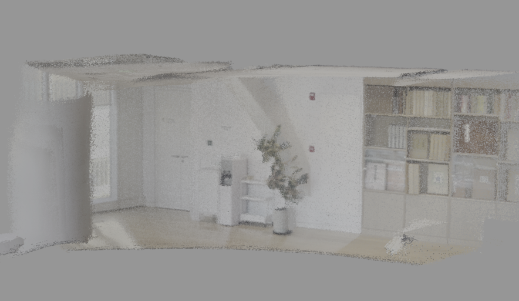
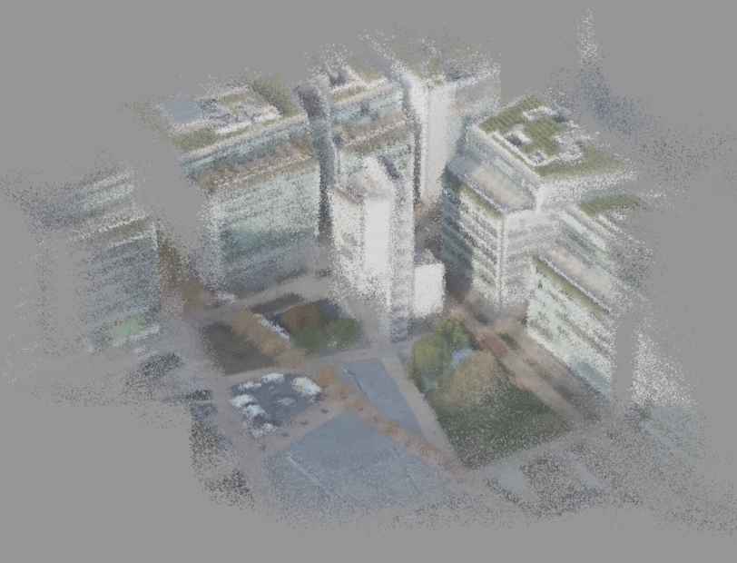
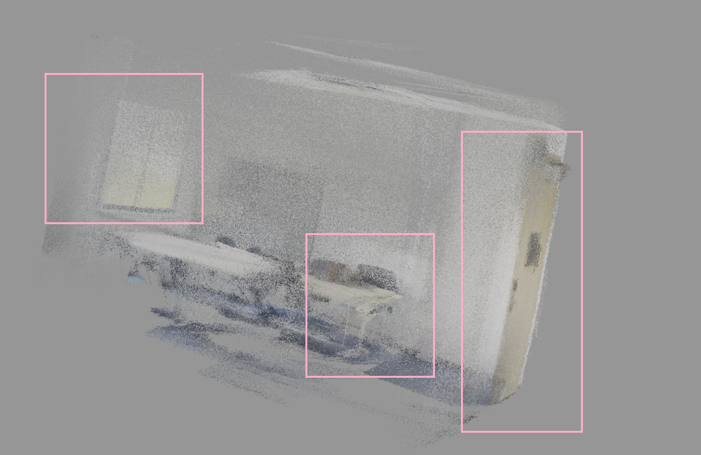
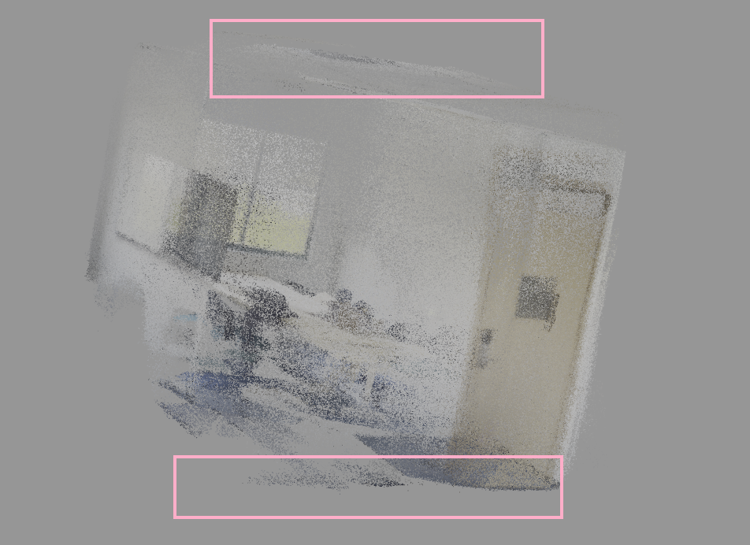

<!-- .slide: data-background="arvr/cover.png" -->
Note:
3part，项目及背景简介，SLAM3R系统架构分析，实验运行效果展示。论文复现与代码尝试工作，在windows批处理，数据采集验证效果

<!--v-->
<!-- .slide: data-background="arvr/background.png" -->

## 「项目简介」SLAM3R 系统

- SLAM3R 是一种专注于高效实时稠密场景重建的端到端系统
- 通过从单目 RGB 视频中直接生成稠密 3D 点云，结合局部到全局的增量式注册方法，实现了全局一致性的重建，兼顾计算精度与实时性。
- 潜在应用包括室内外场景重建、游戏与虚拟现实、无人机数据处理等。

<div class="center">

</div>

Note:
单目 RGB，可以没有深度传感器

<!--v-->
<!-- .slide: data-background="arvr/background.png" -->

## 「背景介绍」SLAM 技术原理

<div class="mul-cols">
<div class="col">

- 同时定位与建图 (Simultaneous Localization and Mapping)
- 核心任务：
  - 确定传感器在场景中的位姿。
  - 构建包含场景几何信息的地图。
- 工作原理：
  - 前端：前端任务主要包括特征提取与匹配。
  - 后端：后端主要涉及图优化与位姿估计
- 右图为视觉 SLAM 的典型流程图。

</div>
<div class="col">

<div class="center">

</div>

</div>
</div>

<div class="mul-cols">
<div class="col">

<!-- ## 「背景介绍」SLAM 技术发展

SLAM 技术方法发展:
- 2011-2015: 传统特征提取与滤波方法，稀疏地图。
- 2017-2020: 深度学习用于深度估计和特征提取，提高动态场景鲁棒性。
- 2021-2023: 神经隐式场景表示，使用NeRF等技术提升稠密建图质量。

<div class="center">

</div>

Note:
经典计算机视觉算法提取图像特征。基于滤波（如 EKF-SLAM）或稀疏优化进行场景定位和建图。
算法成熟且运行速度快，生成的地图仅包含关键点，缺乏稠密信息，难以满足精细重建需求。

使用卷积神经网络（CNN）代替传统的手工特征提取方法引入深度学习网络用于估计深度图和视觉里程计。

神经隐式场景表示（如 NeRF 和 NICE-SLAM）渲染和优化过程非常耗时，训练过程繁琐，对硬件依赖严重。
通常依赖于额外的深度传感器 -->
<!--v-->
<!-- .slide: data-background="arvr/background.png" -->

## 「背景介绍」原有技术局限

- 传统稠密与端到端重建方法:
   - 高耗时需求：无法实时生成 3D 点云，限制动态场景应用；三角化和全局优化复杂，耗时长。
   - 累积漂移：逐帧重建误差累积，影响全局一致性；多视图扩展成本高。
- 语义重建与神经隐式表示:
   - 实时性能差：渲染和优化耗时长。
   - 硬件依赖性高：需要高性能 GPU 支持。

<div class="center">

</div>

Note:
这里列的技术局限大家可以简要看一下，下面这张图是21年的一个神经隐式表达的work，它使用单层 MLP 作为场景的隐式表示，将输入的坐标映射为几何信息，实现了场景的重建。图中的彩色区域代表了重建的 3D 场景，黄色轨迹是预测的相机轨迹，红色轨迹是实际的轨迹。从结果中我们可以看到 iMAP 的重建效果，他在大规模场景中难以扩展，且全局更新可能导致灾难性遗忘。此外，优化过程的收敛速度较慢，也是一个限制因素

<!--v-->
<!-- .slide: data-background="arvr/background.png" -->

## 「项目分析」SLAM3R 整体设计

1. 滑动窗口机制:
   - 将视频分割为多个重叠的时间窗口，每个窗口作为局部场景。
   - 每个窗口通过 I2P 模块生成局部点云，并通过 L2W 模块进行全局对齐。
2. I2P 模块 (Images-to-Points):
   - 从 RGB 视频中直接预测稠密 3D 点云。
   - 使用 Transformer 架构提取特征并生成局部点云。
3. L2W 模块 (Local-to-World):
   - 将 I2P 模块生成的局部点云对齐至全局坐标系。
   - 采用增量式注册方法，保证全局一致性。
4. 轻量场景检索（Global Retrieval）代替传统回环检测:
   - 从历史关键帧中选择最相关的参考帧。
   - 减少漂移，提高点云融合的精度和效率。

Note:
I2P对每个窗口选择关键帧作为参考坐标系，3D点回归；L2W增量式全局注册，重叠窗口，融合更新。
I2P改进：引入滑动窗口机制、优化 Transformer 架构以及与 L2W 的协同设计
<!--v-->
<!-- .slide: data-background="arvr/background.png" -->

## 「项目分析」SLAM3R 关键技术
  
- I2P 模块:
  - 使用 Vision Transformer 提取多视图图像特征，通过自注意力机制捕获局部空间相关性，增强特征表达。
  - 引入交叉注意力机制，结合关键帧和辅助帧进行特征融合。
- L2W 模块:
  - 采用增量式注册方法，对局部点云进行全局对齐。
  - 自包含检索模块，帮助系统选择最佳的历史帧，增加全局一致性。

<div class="center">

</div>


Note:
通过基于Transformer 的 Eimg 图像编码器提取关键帧和辅助帧的视觉特征。自注意力机制捕获帧内局部特征关系，交叉注意力机制实现关键帧与辅助帧的特征融合。
Dkey 生成关键帧的点云,Dsup 生成辅助帧的点云,被记录到缓冲区中，等待后续的全局对齐。缓冲TOP-K相关性最好的作为全局注册的支持帧

滑动窗口中的第一窗口初始化场景模型，为后续的点云对齐提供参考
Global Retrieve：在场景中找到与当前帧相关的参考帧或场景片段。它的目的是通过引用全局范围内的历史信息，提升点云重建的全局一致性和场景理解能力。（基于特征匹配，执行度评估，时序信息）
检索历史帧中与当前帧相关的场景片段，用于全局对齐。

Epts 点云编码器，对点云进行特征提取，生成点云特征。
D_Scen 对场景点云进行解码，优化点云表示。
D_register 增量式对齐新注册的点云，更新全局坐标系。
<!--s-->
<!-- .slide: data-background="arvr/background.png" -->

<div class="middle center">
<div style="width: 100%">

# 代码运行与实验结果

</div>
</div>

<!--v-->
<!-- .slide: data-background="arvr/background.png" -->

## 「项目测试」实验模块与参数设置

- 充分理解代码模块的情况下，编写一个 Windows 下的批处理自动化脚本，整合视频分帧与自动化运行，便于在 Linux 环境虚拟机不方便分配 GPU 资源时进行测试。
- **模型定义**:
```batch
set I2P_MODEL=Image2PointsModel(pos_embed='RoPE100', img_size=(224, 224), head_type='linear',
        output_mode='pts3d', depth_mode=('exp', -inf, inf), conf_mode=('exp', 1, inf), enc_embed_dim=1024, enc_depth=24, enc_num_heads=16, dec_embed_dim=768, dec_depth=12, dec_num_heads=12, mv_dec1='MultiviewDecoderBlock_max', mv_dec2='MultiviewDecoderBlock_max', enc_minibatch=11)
set L2W_MODEL=Local2WorldModel(pos_embed='RoPE100', img_size=(224, 224), head_type='linear',
        output_mode='pts3d', depth_mode=('exp', -inf, inf), conf_mode=('exp', 1, inf), enc_embed_dim=1024, enc_depth=24, enc_num_heads=16, dec_embed_dim=768, dec_depth=12, dec_num_heads=12, mv_dec1='MultiviewDecoderBlock_max', mv_dec2='MultiviewDecoderBlock_max', enc_minibatch=11, need_encoder=False)
```
- **重建参数设置**:
```batch
set TEST_NAME=gen_arch_full
set KEYFRAME_FREQ=-1 # 关键帧选择的频率，-1 通常表示按动态策略选择关键帧，而不是固定间隔
set WIN_R=5 # 滑动窗口的半径，决定当前帧与周围多少帧进行关联
set UPDATE_BUFFER_FREQ=1 # 滑动窗口中更新缓冲区的频率
···
set NUM_POINTS_SAVE=1000000 # 保存的点云数据的最大点数
```

Note:
写了一个windows下的批处理脚本，使得SLAM3R的模型定义和参数设置可以在windows下一键运行。
<!--v-->
<!-- .slide: data-background="arvr/background.png" -->

## 「项目测试」运行 log

- 可见关键步骤的运行日志，包括 I2P 等模型选择、关键帧选择、局部点云生成、全局对齐、点云过滤等。

<div class="center">

</div>

<!--v-->
<!-- .slide: data-background="arvr/background.png" -->

## 「项目测试」代表性室内外实验效果

- 除去对论文已有数据集的测试外，我还前往天目里等地，用不同的设备（iOS 手机、安卓手机、无人机）采集了场景数据，用于测试 SLAM3R 的重建效果。

<div class="mul-cols">
<div class="col">

- 室内场景 - 杭州天目里美术馆
  - 输出: 稠密的 3D 点云，重建场景中的几何和纹理细节。较为完整、封闭的室内场景。
  - 可见，手机横屏视角，移动平缓的情况下，重建效果较好。
</div>
<div class="col">

<div class="center">

</div>

</div>
</div>

<div class="mul-cols">
<div class="col">

<div class="mul-cols">
<div class="col">

- 室外场景 - 杭州天目里无人机数据
  - 输出: 大规模建筑的稠密点云重建。
  - 可见，在无人机高度视角下，无论是建筑物轮廓还是地面细节，重建效果都较好。

</div>
<div class="col">

<div class="center">

</div>

</div>
</div>

<div class="mul-cols">
<div class="col">

<!--v-->
<!-- .slide: data-background="arvr/background.png" -->
## 「项目测试」输入测试


<div class="mul-cols">
<div class="col">

- 当输入视频的视角较局限时（窗口如下图），局部效果仍然较好，可以看见右图中桌椅、门、窗户等细节。
<div class="center">

</div>

</div>
<div class="col">

<div class="center">

</div>

</div>
</div>


<div class="mul-cols">
<div class="col">

- 然而，在边缘处出现明显断裂现象。
  - 例如，右图中的桌椅和右图中的窗户，由于视角差异较大，导致重建结果不连续。
  - 可以通过增加关键帧的选择频率，提高全局对齐的稳定性。

</div>
<div class="col">

<div class="center">

</div>

</div>
</div>

<!--v-->
<!-- .slide: data-background="arvr/background.png" -->
## 「项目测试」实验参数探索

- 数据集：天目里5楼美术馆（手机摄影室内场景）、天目里外围建筑（无人机航拍室外场景）。
- 设备：NVIDIA RTX 1060 GPU。
- 实验参数：
  - `KEYFRAME_FREQ`: 从动态 (-1) 到固定频率 (3)。
  - `WIN_R`: 调整滑动窗口半径 (2, 5, 20)。
  - `NUM_POINTS_SAVE`: 限制点云保存数量 (100万到500万)。
- 评估指标
  - 运行时间：系统的实时性与计算效率。
  - 存储开销 (MB)：点云数据的总大小。
  - 场景完整度：重建场景的完整性和细节融合效果。

</div>
</div>

<!--v-->
<!-- .slide: data-background="arvr/num_point.png" -->
## 「项目测试」保存点云数目对比

<!--v-->
<!-- .slide: data-background="arvr/WIN_R.png" -->
## 「项目测试」WIN_R 对比

<!--v-->
<!-- .slide: data-background="arvr/FREQ.png" -->
## 「项目测试」KEYFRAME_FREQ 对比

<!--v-->
<!-- .slide: data-background="arvr/background.png" -->
## 「项目测试」实验参数结论

<div class="mul-cols">
<div class="col">

- KEYFRAME_FREQ:
  - 动态策略（设置为 -1）在关键帧选择中根据场景变化自适应调整，从而平衡计算成本和重建精度。但选择频率的部分本身比较耗时。
  - 提高关键帧选择频率虽然可以提升场景重建精度，计算开销虽然增加但并不显著。
- WIN_R:
  - 较小的窗口半径提高了实时性，但可能略微降低全局一致性。
  - 过大的窗口半径可能会引入更多噪声，影响数据同化性。

</div>
<div class="col">

- CONF_THRES_L2W:
  - 较低的阈值可能会引入更多噪声，影响全局点云融合的质量。
  - 默认值12提供了一个较为平衡的结果，既保证了精度，又控制了噪声干扰。
- NUM_POINTS_SAVE:
  - 保存更多点云数据可以提高场景的细节重建效果，但存储成本会相应增加。
  - 在 100 万到 500 万点云的范围内进行了实验评价，不同场景需求差异明显。
<!--v-->
<!-- .slide: data-background="arvr/background.png" -->

## 「项目分析」定性对比相关论文工作

| **性能指标**        | **SLAM3R**      | **Dust3R**        | **NICER-SLAM**   |
|---------------------|-----------------|-------------------|------------------|
| 重建精度 (cm)   | 2.1         | 2.3  | 2.4   |
| 帧率 (FPS)      |高       | 较高   |很低   |
| 数据兼容性      | RGB 视频        | RGB 视频 | RGB-D            |
| 计算需求        | GPU要求低| GPU要求较高  | 高性能GPU需求  |

- 虽然没有复现其余两篇工作，但是通过分析论文以及它们的 online demo 作为对比，可以得到：
  - NICER-SLAM 尽管在重建精度上表现出色但帧率极低；高度依赖深度传感器，限制了在单目 RGB 视频中的应用。
  - Dust3R 可以对双视图预判定进行实时操作，但拓展成多视图需要穷举配对和额外的全局优化步骤，性能受较大影响。
  - SLAM3R 通过轻量化模型，在同一坐标系中执行增量场景重建，用自检索系统进行重叠融合，实现精度和实时性较好的平衡。

<!--v-->
<!-- .slide: data-background="arvr/background.png" -->

## 「项目总结」优缺点与优化方向

- **优点**：
  - 兼容性高，适用于 Linux、Windows 等不同架构的操作系统，且在性能一般的电脑上仍然运行较为顺利。
  - 精度较高，在室内外场景中均能较好地重建场景，细节丰富。
  - 强可操作性，通过参数微调即可灵活适应不同需求。
- **缺点**：
  - 由于缺乏回环检测，对于视角差异较大的视频，在全局对齐时可能出现断裂现象，需要进一步优化。
- **优化方向**：
  - 探索更高效的全局融合算法以进一步优化性能。
  - 根据窗口视角的不同，设计不同的全局对齐策略，或自动选择 WIN_R 等相关参数，提高重建效果。
  - 结合场景语义信息，融入基于内容的自适应策略，提高资源利用效率。
  - 移植到移动设备，实现端上计算，开发实时交互式重建应用。

<!--v-->
<!-- .slide: data-background="arvr/background.png" -->

## 「项目总结」应用场景与展望

- 室内外大规模三维重建
  - 大型公共设施（车站、体育馆、博物馆等）的全景三维建模。工程施工现场的实时捕捉与监控，辅助设计决策与进度管理。
  - 历史遗迹、文物古建筑的数字化保护与虚拟旅游。
- 自主导航与机器人视觉
  - 为自动驾驶汽车提供导航地图与实时障碍物检测。
  - 用于救援、勘探、巡检等特种机器人的环境感知与路径规划。    
- 游戏与虚拟现实
  - 游戏场景自动生成，提升开发效率和灵活性。基于真实场景的VR内容制作，打造沉浸式体验。
  - 支持用户自定义创作，实现虚实融合的游戏化互动。
- 无人机測绘与城市信息模型（CIM）
  - 农林、电力、交通等领域的地物普查与三维建模。 
  - 面向数字孪生城市的实景三维重建，推进CIM平台建设。 

<!--s-->
<!-- .slide: data-background="arvr/background.png" -->

<div class="middle center">
<div style="width: 100%">

# Reference

</div>
</div>

<!--v-->
<!-- .slide: data-background="arvr/background.png" -->

- [SLAM3R: Real-Time Dense Scene Reconstruction from Monocular RGB Videos](https://arxiv.org/abs/2412.09401): 提出一种从单目 RGB 视频直接生成稠密 3D 点云的端到端系统，兼顾实时性与重建精度。
- [NICER-SLAM: Neural Implicit Scene Encoding for RGB SLAM](https://arxiv.org/abs/2302.03594): 使用神经隐式场景编码方法提升 SLAM 的稠密建图质量与鲁棒性。
- [DUSt3R: Geometric 3D Vision Made Easy](https://arxiv.org/abs/2312.14132): 强调几何 3D 视觉的易用性，简化了复杂场景中的 3D 重建。
- [How NeRFs and 3D Gaussian Splatting are Reshaping SLAM: a Survey](https://arxiv.org/abs/2402.13255): 综述了 NeRF 和 3D Gaussian Splatting 技术在 SLAM 中的应用及其影响。
- [NICE-SLAM: Neural Implicit Scalable Encoding for SLAM](https://arxiv.org/abs/2112.12130): 提出一种可扩展的神经隐式编码 SLAM 方法，适用于大规模场景的高精度重建。


<!--s-->
<!-- .slide: data-background="arvr/ending.png" -->
