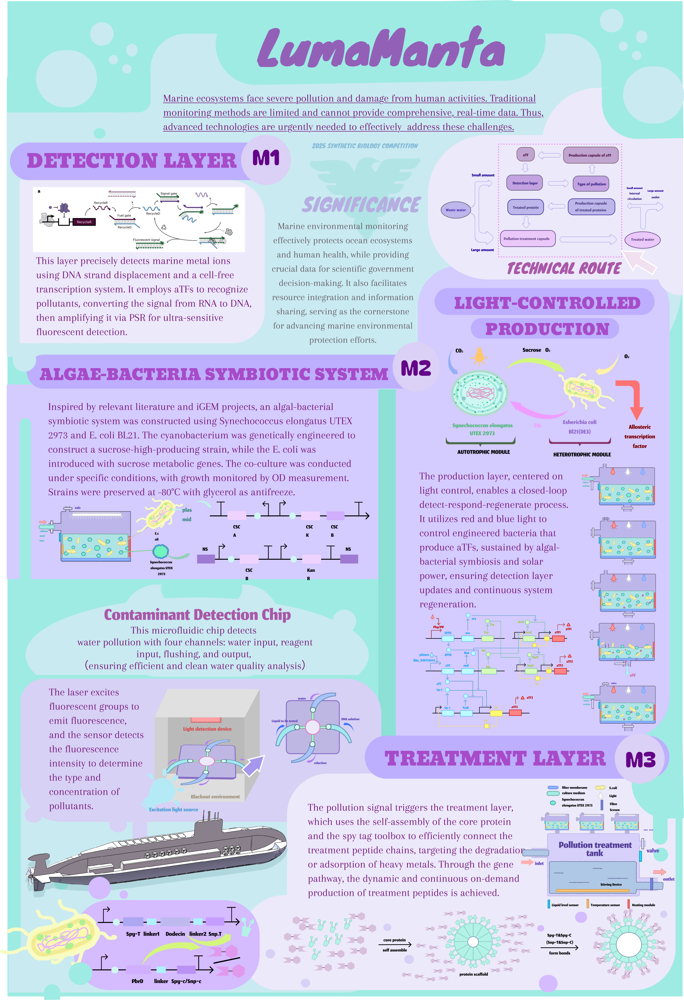
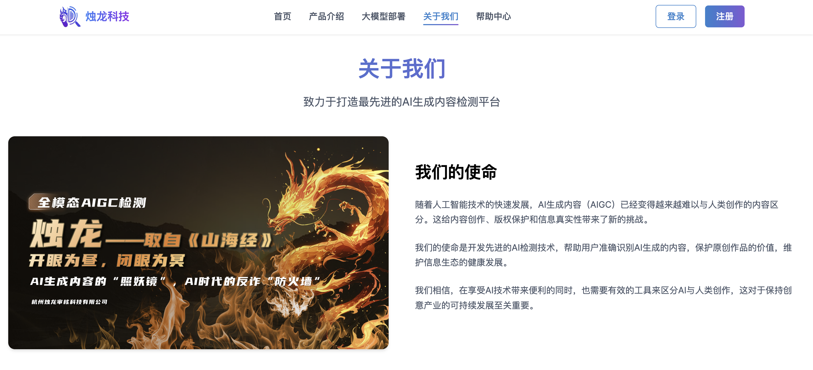

<!-- .slide: data-background="hkust/cover.png" -->

<!--v-->
<!-- .slide: data-background="hkust/background.png" -->

## About Me

  
<strong>Zixin Lin (林子昕)</strong> | B.Eng. Candidate in Information Security, Zhejiang University (2022-2026).

  
Passionate about leveraging <strong>AI & IoT</strong> for innovative solutions. Currently Team Leader for ZJU-CHINA iGEM 2025 Team.

  
  <!-- 
<strong>Academic Background:</strong>
 -->
  <ul style="font-size: 0.9em;">
    <li><strong>Zhejiang University (2022 – 2026):</strong> 
      <ul style="font-size: 0.9em;">
        <li>Information Security (CS & Tech) | GPA: 3.93/4.3 </li>
        <li>Relevant Courses: CompSys (98), SW Security (99), CTF Practice (99).</li>
      </ul>
    </li>
    <li style="margin-top:10px;"><strong>University of California, Irvine (Summer 2024):</strong> 
      <ul style="font-size: 0.9em;">
        <li>AI Summer Program</li>
        <li>Relevant Courses: Introduction to ML & AI (A+), Academic Writing (A+).</li>
      </ul>
    </li>
  </ul>

<!--s-->
<!-- .slide: data-background="hkust/background.png" -->

# Publications

<!--v-->
<!-- .slide: data-background="hkust/background.png" -->

## Publications in AI field

  

    <strong>DMind Benchmark: Toward a Holistic Assessment of LLM Capabilities across the Web3 Domain</strong> 
    <em>NeurIPS 2025 Datasets and Benchmarks Track Submission (Under Review)</em> 
    Enhao Huang, Pengyu Sun, <strong>Zixin Lin</strong>, Alex Chen, Joey Ouyang, et al.
  

  

    <strong>Long Context Scaling: Divide-and-Conquer via Multi-Agent Question-driven Collaboration</strong> 
    <em>NeurIPS 2025 Conference Submission (Under Review)</em> 
    Sibo Xiao, <strong>Zixin Lin</strong>, Wenyang Gao, Yue Zhang
  

  

    
  

  

    
  

  

<!--v-->
<!-- .slide: data-background="hkust/background.png" -->

## Publications in IoT field

  

    <strong>DiskSpy: Exploring a Long-Range Covert-Channel Attack via mmWave Sensing of &mu;m-level HDD Vibrations</strong> 
    <em>USENIX Security Symposium 2025 (Accepted)</em> 
    Weiye Xu, Danli Wen, Jianwei Liu, <strong>Zixin Lin</strong>, Yuanqiang Zheng, Xian Xu, Jinsong Han
  

  

    <strong>Practical EMI Attacks on Smartphones With Users' Commands Cancelled</strong> 
    <em>IEEE Trans. Dependable Secur. Comput. (TDSC)</em> 
    Ming Gao, Fu Xiao, Wentao Guo, <strong>Zixin Lin</strong>, Weiran Liu, Jinsong Han
  

  

    
  

  

    
  

  

<!--s-->
<!-- .slide: data-background="hkust/background.png" -->

# Innovation & Project

<!--v-->
<!-- .slide: data-background="hkust/background.png" -->

## LumaManta: Marine Protect System

- **Project & Goals:** Targeting Gold in <strong>iGEM 2025</strong> with an integrated underwater system for multi-pollutant detection, quantification, & in-situ treatment to combat marine pollution.

  

    
  

  

    
<strong>My Role:</strong> Team Leader, ZJU-CHINA iGEM Team (selected after leading the development of a comprehensive proposal & wiki for the competitive university team trials).

    
  

<!--v-->
<!-- .slide: data-background="hkust/background.png" -->

## DragonZhu: AIGC Detection Tool

- **Project & Achievements:** Developed and deployed a web-based platform for detecting multimodal AI-Generated Content (text, images, audio, video). The project achieved a **National Gold Award** in the China "Internet+" Innovation and Entrepreneurship Competition.
- **My Role:** Team member, involved in developing the user-friendly interface, data processing capabilities, and backend services for API interaction and result visualization.

<!--v-->
<!-- .slide: data-background="hkust/background.png" -->
## XRoot CPU: RISC-V System

- **Project & Achievements:** Designed and implemented a complete computer system, from a 64-bit RISC-V processor (hardware) to an OS kernel with multitasking and memory management (software). The work was featured in the "Computer System Interdisciplinary Course Experiment Guide (RISC-V Architecture)".
- **My Role:** Initially completed individual full-stack (hardware & software) development. In the final team-based hardware-software co-design phase, responsible for the software component.

  

    
  

  

    
  

<!--s-->
<!-- .slide: data-background="hkust/background.png" -->

# Why InnoBay & Why Me

<!--v-->
<!-- .slide: data-background="hkust/background.png" -->

## How I Can Contribute to InnoBay

*   **Marine Tech Alignment:** My **LumaManta (iGEM 2025)** leadership, developing an *intelligent underwater system for marine pollution*, directly fits InnoBay's theme, bringing hands-on marine solution experience.

*   **Proven Technical & Prototyping Skills:** **XRoot CPU** (HW/SW co-design) & the award-winning **DragonZhu AIGC Tool** demonstrate strong *solution development, technology realization*, and experience in taking ideas to *prototypes & pitches*.

*   **Innovation & Entrepreneurial Spirit:** National Gold for DragonZhu & iGEM leadership highlight my *entrepreneurial drive*; eager for *GBA cross-border collaboration*.

*   **Collaborative Mindset:** As iGEM Team Leader, practiced in *interdisciplinary teamwork*, essential for tackling complex marine tech challenges.

<!--v-->
<!-- .slide: data-background="hkust/background.png" -->

## My Aspirations

*   **Learn from Experts:** Gain insights from **HKUST professors & industry leaders** on applying cutting-edge tech to real-world problems.

*   **Master Innovation Lifecycle:** Experience the full journey from product definition & user research to *prototyping & commercialization strategies* in HKUST's *labs & maker spaces*.

*   **Engage with GBA Ecosystem:** Connect with the **GBA innovation hub**, explore Dongguan's manufacturing, & learn to leverage regional policies/funding for impactful solutions.

*   **Turn Ideas into Impact:** Enhance ability to create **tangible marine tech solutions** & explore HKUST MPhil/MSc pathways in technology innovation.

<!--v-->
<!-- .slide: data-background="hkust/background.png" -->

## Core Skills

- **Programming Languages:**
  - Python, C, C++, Java, JavaScript
- **Frameworks & Tools:**
  - Linux, Git, Docker, Unix Kernel, React
- **Leadership & Collaboration:**
  - **Team Leader for ZJU-CHINA iGEM**, experienced in guiding a multidisciplinary team towards a common goal.
- **Research & Academic:**
  - Experience with the full research cycle from ideation to publication.
- **Languages:**
  - English (Fluent, TOEFL 104)
  - Mandarin (Native)

<!--s-->
<!-- .slide: data-background="hkust/end.png" -->

