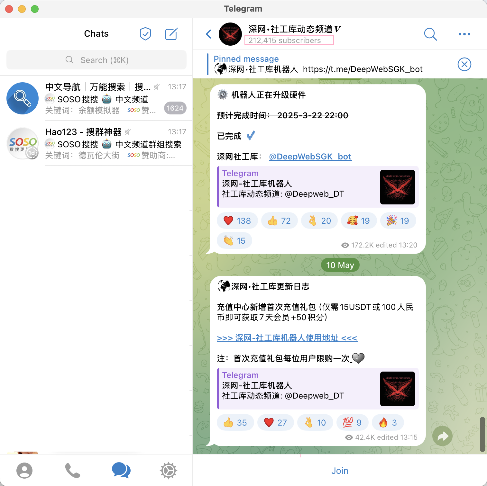

<style>
:root {
  --r-main-font: "Times New Roman", "LXGW WenKai Screen", sans-serif;
  --r-heading-font: "JetBrains Mono", "LXGW WenKai Screen", sans-serif;
  --r-code-font: "JetBrains Mono", "LXGW WenKai Screen", sans-serif;
}
</style>

<!-- .slide: data-background="tua-app/cover.png" -->


<!--v-->
<!-- .slide: data-background="tua-app/content.png" -->

<h2 style="color: #337ab7;">Content</h2>

<!--s-->
<!-- .slide: data-background="tua-app/background.png" -->

<div class="middle center">
<div style="width: 100%">

<h1 style="color: #337ab7;">Introduction</h1>

</div>
</div>

<!--v-->
<!-- .slide: data-background="tua-app/background.png" -->

<h2 style="color: #337ab7;">Introduction</h2>

**Telegram**, due to its end-to-end encryption, anonymous user identity, and weak content moderation, has increasingly become a distribution platform for **underground mobile applications**.
These apps are often banned or restricted on mainstream app stores and include:

<div class = 'mul-cols'>
  <div class = 'col'>
    <ul>
        <li>Pornographic content</li>
        <li>Gambling platforms</li>
        <li>Pirated software</li>
        <li>Apps involved in fraud, phishing, and privacy violations</li>
    </ul>
  </div>
  <div class = 'col'>
    
  </div>
  <div class = 'col'>
    
  </div>
  </div>
</div>

These threats highlight the urgent need to understand how such apps are disseminated at scale — particularly through Telegram's bot-assisted and channel-based infrastructure.

<!--v-->
<!-- .slide: data-background="tua-app/background.png" -->

<h2 style="color: #337ab7;">Introduction</h2>

In this project, we aim to systematically collect, extract, and identify Telegram URLs associated with underground app distribution through multi-stage automation, providing a foundation for further analysis.

Specifically, we aim to:
- **Discover** underground Telegram channels using search bots and keywords.
- **Extract** all URLs from the historical messages of those channels.
- **Identify** app download pages by analyzing URL content (e.g., download, Android, iOS).
- **Validate** and collect **at least 200 effective app download URLs**.
- **Deliver** a final report including:
  - The discovered channels
  - The validated download URLs
  - Technical workflow and key findings

<!--s-->
<!-- .slide: data-background="tua-app/background.png" -->

<div class="middle center">
<div style="width: 100%">

<h1 style="color: #337ab7;">Background</h1>

</div>
</div>

<!--v-->
<!-- .slide: data-background="tua-app/background.png" -->

<h2 style="color: #337ab7;">Background: Telegram Ecosystem</h2>

Telegram is a cross-platform encrypted messaging app with **800M+ users**.
- It supports public and private **channels** and **groups**, allowing admins to broadcast content to large audiences.
- Telegram enables **anonymous interaction**, lacks **moderation**, and supports **mass forwarding**, making it ideal for underground distribution.
<!-- - Researchers often treat both channels and groups as “channels” for simplicity. -->
- It has evolved into a **cybercrime ecosystem**, including: Money laundering, financial fraud, Piracy and revenge porn, Trade of personal information

<div style="display: flex; justify-content: center; align-items: center; gap: 40px;">
  
  
</div>


<!--v-->
<!-- .slide: data-background="tua-app/background.png" -->

<h2 style="color: #337ab7;">Background: Bots in Telegram</h2>


- Telegram’s Bot API allows developers to create bots for automation.
- "Search bots" offer keyword-triggered channel recommendations.
- Many **underground actors buy keyword slots** (e.g., “VPN”, “Baccarat”) to promote their channels in top ranks.
- Channels listed under paid results are **strategically boosted** to reach wider audiences.

<div class="mul-cols">
  <div class="col">
    
  </div>
<div class="col">
    
  </div>
  <div class="col">
    
  </div>
</div>

<!--v-->
<!-- .slide: data-background="tua-app/background.png" -->

<h2 style="color: #337ab7;">Background: App Package</h2>

Android and iOS, the two dominant mobile operating systems, employ distinct app installation package formats and distribution mechanisms.

<div class="mul-cols">
  <div class="col">
    <p><strong>Android: Open but Vulnerable</strong></p>
    <ul>
      <li>Uses <span style="color: #337ab7;">.apk</span> format (Android Package Kit)</li>
      <li>Users can sideload apps from unofficial sources (web links, Telegram, marketplaces)</li>
      <!-- <li>This openness enables underground developers to bypass app store vetting</li> -->
    </ul>
    
  </div>
<div class="col">

<p><strong>iOS: Closed but Not Impenetrable</strong></p>
    <ul>
      <li>Uses <span style="color: #337ab7;">.ipa</span> format (iOS App Store Package)</li>
      <li>Installation usually limited to App Store</li>
      <li>However, alternative channels exist:</li>
      <ul>
        <li>TestFlight (for testing)</li>
        <li>Enterprise Signing</li>
        <li>WebClip (browser shortcut to apps)</li>
      </ul>
    </ul>
    
  </div>

</div>


<!--s-->
<!-- .slide: data-background="tua-app/background.png" -->

<div class="middle center">
<div style="width: 100%">

<h1 style="color: #337ab7;">Methodology</h1>

</div>
</div>

<!--v-->
<!-- .slide: data-background="tua-app/background.png" -->

<h2 style="color: #337ab7;">Workflow</h2>

Our workflow involves three key stages:

- **Identifying Relevant Channels:** We utilized a curated list of keywords with Telegram bots to discover relevant channels.
<!-- This approach yielded over 200 channels for further investigation. -->

- **Gathering Possible URLs:** The message history from these identified channels was systematically collected and parsed.
<!-- From this data, we extracted over 10,000 potential URLs linking to external resources. -->

- **App Collection & Validation:** The collected URLs are currently being processed using Optical Character Recognition (OCR) to identify and extract application information.
<!-- The final number of validated applications from this stage is currently being determined. -->


<!--v-->
<!-- .slide: data-background="tua-app/background.png" -->

<h2 style="color: #337ab7;">Step1: Collect Bots and Channels</h2>

- Registered a Telegram developer account and obtained *api_id* and *api_hash*:
- Applied for API keys at [core.telegram.org](https://core.telegram.org/api/obtaining_api_id) and used [Telethon](https://docs.telethon.dev/en/stable/index.html) to interact with Telegram
- Collected top 15 Telegram bots (e.g. *@hao1234bot*)  
- Compiled keywords in **Chinese and English**  
  > e.g., "VPN", "91", "Crack", "porn", "百家乐"

```rust
with open('300keywords.txt', 'r') as f:
    keywords = list(set(keyword.strip() for keyword in f.read().splitlines() if keyword.strip()))
random.shuffle(keywords)
...
async with client.conversation(entity) as conv:
    words = random.sample(keywords, keyword_num)
    for word in words:
      try:
        await conv.send_message(word)
```

<!--v-->
<!-- .slide: data-background="tua-app/background.png" -->

<h2 style="color: #337ab7;">Step2: Extract URLs from Bots</h2>

- Used Telethon to collect all messages from each identified channel
- Parsed historical messages (limit: 1000 messages per channel)
- Extracted *t.me/...* links from message entities
- Avoided crawling outdated or inactive links

```rust
re.findall(r'https?://t\.me/\w+', message.message)
```

```rust
# Adjust limit to control the number of messages to be processed
async for message in client.iter_messages(entity, limit=1000):
  try:
    if message.entities:
      for msg in message.entities:
        if hasattr(msg, 'url'):
          urls.append(msg.url)
  except:
    print(f'Error processing message {message} in {entity.title}')
      continue
```

<!-- - Filtered and deduplicated URLs -->


<!--v-->
<!-- .slide: data-background="tua-app/background.png" -->

<h2 style="color: #337ab7;">Step3: Identify App Pages</h3>

- **Filtered** collected URLs to remove irrelevant or repeated domains
- Opened each URL using headless Chrome (Selenium)
- Captured **screenshots** after interacting with typical buttons like "进入", "Continue"
- Applied OCR using **PaddleOCR**, extracting keywords like:
  > download, iOS, apk, android, app

<div class="mul-cols">
  <div class="col">
    
  </div>
  <div class="col">
    
  </div>
  <div class="col">
    
  </div>
</div>

<!--s-->
<!-- .slide: data-background="tua-app/background.png" -->

<div class="middle center">
<div style="width: 100%">

<h1 style="color: #337ab7;">Data Analysis</h1>

</div>
</div>

<!--v-->
<!-- .slide: data-background="tua-app/background.png" -->

...


<!--s-->
<!-- .slide: data-background="tua-app/background.png" -->

<div class="middle center">
<div style="width: 100%">

<h1 style="color: #337ab7;">Conclusion</h1>

</div>
</div>

<!--v-->
<!-- .slide: data-background="tua-app/background.png" -->

<h2 style="color: #337ab7;">Challenges Encountered</h2>

- **Bot Interaction Rate Limiting:** Aggressive keyword probing led to temporary bans due to suspected spamming. We mitigated this by introducing **randomized delays** (asyncio.sleep) and timeouts for unresponsive bots.

- **Entity Type Ambiguity:** t.me/ links may refer to Channel, Chat, or User entities. Telethon APIs require precise type handling—**heuristic algorithms** were added to ensure safe access.

- **Region Restrictions:** To counter regional restrictions, we employed VPN tunneling and alternate Apple ID environments to simulate compliant locales.

- **Mental Health:** Insulted by TUApp users and shattered by massive urls.

<div class="mul-cols">
  <div class="col">
    
  </div>
  <div class="col">
    
  </div>
  <div class="col">
    
  </div>
</div>

<!--v-->
<!-- .slide: data-background="tua-app/background.png" -->

<h2 style="color: #337ab7;">Conclusion</h2>

- We implemented a **semi-automated pipeline** to identify Telegram channels promoting underground apps.
- Our method combined **bot-driven discovery**, **regex-based URL extraction**, **headless browser screenshots**, and **OCR-based keyword recognition**.
- This enabled us to extract and filter **over 200 high-signal URLs** linked to illicit distribution.
- These findings help uncover Telegram’s role in **unregulated app dissemination**, particularly in **Chinese-speaking contexts** where censorship drives alternative distribution.
- Future work can leverage this pipeline to:
  - Expand to **private channels or one-on-one bots**
  - Incorporate **code similarity detection** for app binaries
  - Develop **automated flagging systems** based on message patterns and visual clues

<!--s-->
<!-- .slide: data-background="tua-app/background.png" -->

<div class="middle center">
<div style="width: 100%">

<h1 style="color: #337ab7;">References</h1>

</div>
</div>

<!--v-->
<!-- .slide: data-background="tua-app/background.png" -->

<h2 style="color: #337ab7;">References</h2>

<ul style="font-size: 1.1em;">
  <li>Y. Guo, D. Wang, L. Wang, Y. Fang, C. Wang, M. Yang, T. Liu, H. Wang. <i>Beyond App Markets: Demystifying Underground Mobile App Distribution Via Telegram</i>. ACM PACM IMC, Vol. 8, No. 3, Article 33, 2024.</li>
  <li>Telegram. <i>Telegram Bot API</i>. <a href="https://core.telegram.org/bots/api">https://core.telegram.org/bots/api</a></li>
  <li>Lonami. <i>Telethon: Pure Python MTProto Telegram Client</i>. <a href="https://github.com/LonamiWebs/Telethon">https://github.com/LonamiWebs/Telethon</a></li>
  <li>Apple Inc. <i>A Threat Analysis of Sideloading</i>. <a href="https://www.apple.com/privacy/docs/Building_a_Trusted_Ecosystem_for_Millions_of_Apps_A_Threat_Analysis_of_Sideloading.pdf">PDF</a></li>
  <li>Sixgill. <i>Telegram: A Cybercriminal Hotspot</i>. <a href="https://cybersixgill.com/news/articles/telegram-a-cybercriminal-hotspot-compromised-financial-accounts">Link</a></li>
  <li>10Guards. <i>Is Telegram Turning into a Hub for Cybercrime?</i> <a href="https://10guards.com/en/articles/is-telegram-turning-into-a-hub-for-cybercrime-activities/">Link</a></li>
  <li>Kaspersky. <i>Trojan.AndroidOS.Piom.bbdw</i>. <a href="https://threats.kaspersky.com/en/threat/Trojan.AndroidOS.Piom.bbdw/">Link</a></li>
</ul>

<!--s-->
<!-- .slide: data-background="tua-app/end.png" -->
