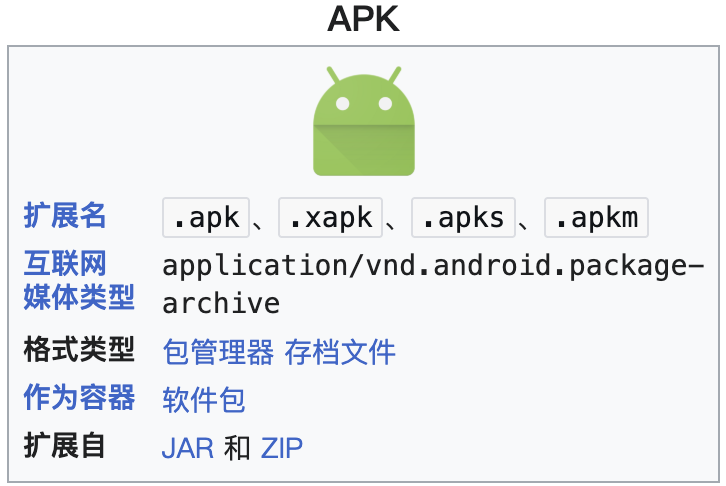

<style>
:root {
  --r-main-font: "Times New Roman", "LXGW WenKai Screen", sans-serif;
  --r-heading-font: "JetBrains Mono", "LXGW WenKai Screen", sans-serif;
  --r-code-font: "Times New Roman", "LXGW WenKai Screen", sans-serif;
}
</style>

<!-- .slide: data-background="tua-app/cover.png" -->


<!--v-->
<!-- .slide: data-background="tua-app/content.png" -->

<h2 style="color: #337ab7;">Content</h2>

<!--s-->
<!-- .slide: data-background="tua-app/background.png" -->

<div class="middle center">
<div style="width: 100%">

<h1 style="color: #337ab7;">Introduction</h1>

</div>
</div>

<!--v-->
<!-- .slide: data-background="tua-app/background.png" -->

<h2 style="color: #337ab7;">Introduction</h2>

**Telegram**, due to its end-to-end encryption, anonymous user identity, and weak content moderation, has increasingly become a distribution platform for **underground mobile applications**.
These apps are often banned or restricted on mainstream app stores and include:

<div class = 'mul-cols'>
  <div class = 'col'>
    <ul>
        <li>Pornographic content</li>
        <li>Gambling platforms</li>
        <li>Pirated software</li>
        <li>Apps involved in fraud, phishing, and privacy violations</li>
    </ul>
  </div>
  <div class = 'col'>
    
  </div>
  <div class = 'col'>
    
  </div>
  </div>
</div>

These threats highlight the urgent need to understand how such apps are disseminated at scale — particularly through Telegram's bot-assisted and channel-based infrastructure.

<!--v-->
<!-- .slide: data-background="tua-app/background.png" -->

<h2 style="color: #337ab7;">Introduction</h2>

In this project, we aim to systematically collect, extract, and identify Telegram URLs associated with underground app distribution through multi-stage automation, providing a foundation for further analysis.

Specifically, we aim to:
- **Discover** underground Telegram channels using search bots and keywords.
- **Extract** all URLs from the historical messages of those channels.
- **Identify** app download pages by analyzing URL content (e.g., download, Android, iOS).
- **Validate** and collect **at least 200 effective app download URLs**.
- **Deliver** a final report including:
  - The discovered channels
  - The validated download URLs
  - Technical workflow and key findings

<!--s-->
<!-- .slide: data-background="tua-app/background.png" -->

<div class="middle center">
<div style="width: 100%">

<h1 style="color: #337ab7;">Background</h1>

</div>
</div>

<!--v-->
<!-- .slide: data-background="tua-app/background.png" -->

<h2 style="color: #337ab7;">Background: Telegram Ecosystem</h2>

Telegram is a cross-platform encrypted messaging app with **800M+ users**.
- It supports public and private **channels** and **groups**, allowing admins to broadcast content to large audiences.
- Telegram enables **anonymous interaction**, lacks **moderation**, and supports **mass forwarding**, making it ideal for underground distribution.
<!-- - Researchers often treat both channels and groups as “channels” for simplicity. -->
- It has evolved into a **cybercrime ecosystem**, including: Money laundering, financial fraud, Piracy and revenge porn, Trade of personal information

<div class="mul-cols">
  <div class="col">
    
  </div>
</div>

<!--v-->
<!-- .slide: data-background="tua-app/background.png" -->

<h2 style="color: #337ab7;">Background: Bots in Telegram</h2>


- Telegram’s Bot API allows developers to create bots for automation.
- "Search bots" offer keyword-triggered channel recommendations.
- Many **underground actors buy keyword slots** (e.g., “VPN”, “Baccarat”) to promote their channels in top ranks.
- Channels listed under paid results are **strategically boosted** to reach wider audiences.

<div class="mul-cols">
  <div class="col">
    
  </div>
<div class="col">
    
  </div>
  <div class="col">
    
  </div>
</div>

<!--v-->
<!-- .slide: data-background="tua-app/background.png" -->

<h2 style="color: #337ab7;">Background: App Package</h2>

Android and iOS, the two dominant mobile operating systems, employ distinct app installation package formats and distribution mechanisms.

<div class="mul-cols">
  <div class="col">
    <p><strong>Android: Open but Vulnerable</strong></p>
    <ul>
      <li>Uses <span style="color: #337ab7;">.apk</span> format (Android Package Kit)</li>
      <li>Users can sideload apps from unofficial sources (web links, Telegram, marketplaces)</li>
      <!-- <li>This openness enables underground developers to bypass app store vetting</li> -->
    </ul>
    
  </div>
<div class="col">

<p><strong>iOS: Closed but Not Impenetrable</strong></p>
    <ul>
      <li>Uses <span style="color: #337ab7;">.ipa</span> format (iOS App Store Package)</li>
      <li>Installation usually limited to App Store</li>
      <li>However, alternative channels exist:</li>
      <ul>
        <li>TestFlight (for testing)</li>
        <li>Enterprise Signing</li>
        <li>WebClip (browser shortcut to apps)</li>
      </ul>
    </ul>
    
  </div>

</div>


<!--s-->
<!-- .slide: data-background="tua-app/background.png" -->

<div class="middle center">
<div style="width: 100%">

<h1 style="color: #337ab7;">Methodology</h1>

</div>
</div>

<!--v-->
<!-- .slide: data-background="tua-app/background.png" -->

<h2 style="color: #337ab7;">Workflow</h2>

<!--v-->
<!-- .slide: data-background="tua-app/background.png" -->

<h2 style="color: #337ab7;">Step1: Collect Bots and Channels</h2>

- Collected top 15 Telegram bots (e.g. `@hao1234bot`)  
- Compiled 300 keywords in **Chinese and English**  
  > e.g., "VPN", "91", "Crack", "Young girl", "暗网"

...

<!-- - For each bot:
  - Automatically join chat
  - Randomly send 2-3 keywords
  - Parse returned message(s) for t.me/channel links -->


<!--v-->
<!-- .slide: data-background="tua-app/background.png" -->

<h2 style="color: #337ab7;">Step2: Extract URLs from Bots</h2>

- Some bots return raw text with embedded links.
- Used regex-based extraction instead of entity objects:

```python
re.findall(r'https?://t\.me/\w+', message.message)
```

...

<!--v-->
<!-- .slide: data-background="tua-app/background.png" -->

<h2 style="color: #337ab7;">Step3: Identify App Pages</h3>


<!--s-->
<!-- .slide: data-background="tua-app/background.png" -->

<div class="middle center">
<div style="width: 100%">

<h1 style="color: #337ab7;">Data Analysis</h1>

</div>
</div>

<!--v-->
<!-- .slide: data-background="tua-app/background.png" -->

...


<!--s-->
<!-- .slide: data-background="tua-app/background.png" -->

<div class="middle center">
<div style="width: 100%">

<h1 style="color: #337ab7;">Conclusion</h1>

</div>
</div>

<!--v-->
<!-- .slide: data-background="tua-app/background.png" -->

<h2 style="color: #337ab7;">Conclusion</h2>

- We implemented a **semi-automated crawler** to interact with Telegram search bots.
- Successfully extracted **1400+ URLs** pointing to potentially underground app promotion channels.
- This list is the foundation for:
  - Historical message crawling (Stage 2)
  - App promotion link identification (Stage 3)

> 🔜 Next: Crawl messages & detect promotion patterns.


<!--v-->
<!-- .slide: data-background="tua-app/background.png" -->

<h2 style="color: #337ab7;">Challenges Encountered</h2>

- ❗ Some bots do not return links but plain text
- ❗ Flooding too many messages leads to muted accounts
- ❗ Channel links are ephemeral — many were **deleted within 24h**
- ✅ Solved with:
  - Regex fallback parsing
  - `asyncio.sleep()` between queries
  - Repeated crawling rounds


<!--s-->
<!-- .slide: data-background="tua-app/end.png" -->
